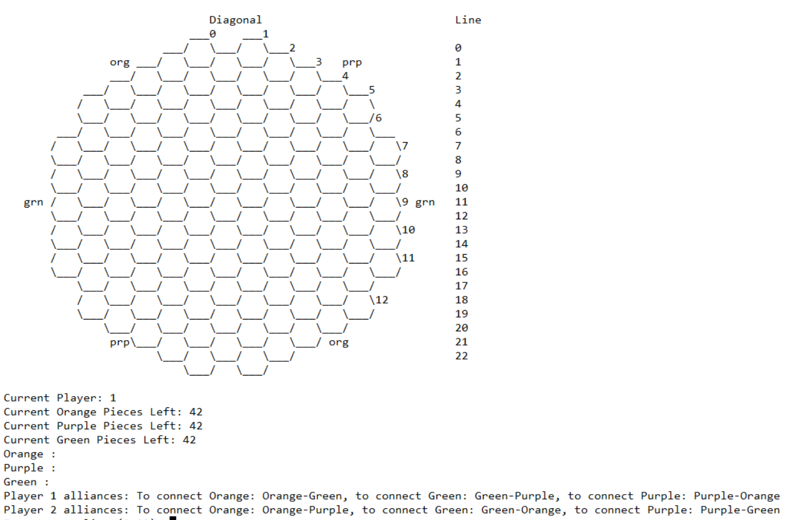
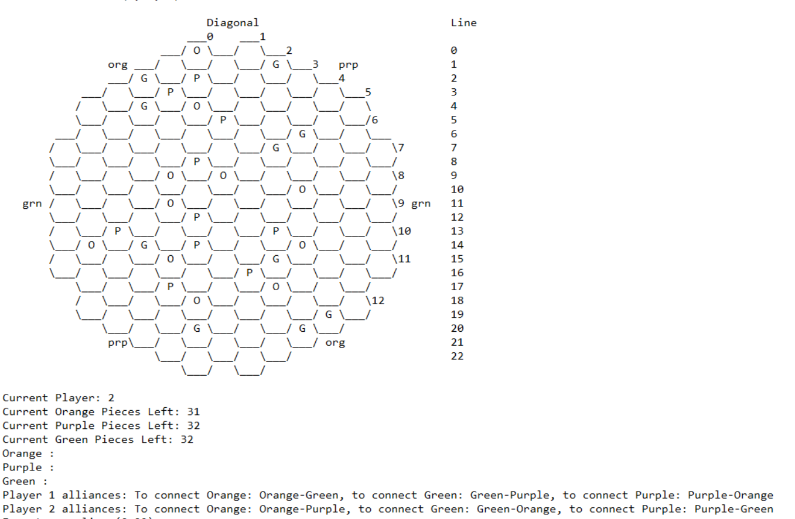

# Alliances-5

## Grupo Alliances_5 Turma 3
Diogo Guimarães do Rosário - 201806582  
Henrique Melo Ribeiro - 201806529

## Instação e execução
De modo a facilitar a utilização do programa foi criado um ficheiro "base" responsável por incluir todos os outros ficheiros. Assim, para correr o programa basta consultar o ficheiro alliances.pl.   
A fonte utilizada foi a "Consolas", de estilo "Regular" e tamanho 12.     
Depois de consultar o ficheiro basta correr o predicado principal play/0.

## Alliances
O objetivo final do jogo é ganhar 2 das 3 cores disponíveis.  
Para ganhar uma cor é necessário unir totalmente 1 cor de um lado ao outro do tabuleiro usando essa cor e a sua cor aliada ou então bloquear o adversário, isto é, usar a cor que nem é aliada nem a própria de modo a que seja impossível de fazer um caminho.     
Por exemplo, assumindo que o jogador 1 tem como aliada da cor laranja a cor verde e o jogador 2 tem como aliada da cor laranja a cor roxa. Para o jogador 1 ganhar a cor laranja, pode fazer um caminho ininterrupto de peças laranja e/ou verdes, ou então "cortar" o tabuleiro com a cor verde, o que faria com que o jogador 2 nunca conseguisse unir as 2 bordas do tabuleiro, visto que a cor roxa não é nem laranja, nem aliada da laranja para si.   
As cores aliadas são definidas no início do jogo e variam entre os jogadores.     
Existem 42 peças de cada cor (laranja, verde e roxo) que são partilhadas entre os 2 jogadores.    
As jogadas são intercaladas entre os jogadores e consistem em colocar uma peça de qualquer cor em qualquer casa vazia.  
As regras do jogo podem ser encontradas com mais detalhe no seguinte [link.](https://nestorgames.com/rulebooks/ALLIANCES_EN.pdf)
A página do jogo pode ser encontrada [aqui.](https://nestorgames.com/#alliances_detail)

## Lógica do Jogo

### Representação interna do jogo
É usada uma lista de listas para guardar o estado do jogo. As listas internas têm diferentes tamanhos, de modo a representar o número de hexágonos em cada linha. Foi usado um sistema de coordenadas de 2 eixos, um vertical e um diagonal, ambos começando no valor 0. <br />
### Estado inicial
 <br />
O jogador atual e o número de peças restantes de cada cor são representados no fundo do board, bem como as alianças para as cores de cada jogador.
As casas vazias são representados pelo valor empty, enquanto que as peças são representadas por 1 dos 3 seguintes valores - orange, green, purple. 
```prolog
cell_val(orange, 'O').
cell_val(green, 'G').
cell_val(purple, 'P').
cell_val(empty, ' ').
```
Para a visualização do jogo foram criados os seguintes predicados
```prolog
display_game([Board , Colors, NPieces | _],Player):-
    nl,
    close_hex_top,
    display_board(Board,Player,0),
    close_hex_bot,
    nl,
    display_player(Player),
    display_remaining_pieces(NPieces),
    display_colors(Colors),
    display_alliances.

display_board([],_,_).
display_board(GameState,Player,NRow) :-
    [H | T] = GameState,
    display_line(H,NRow),
    NewRow is NRow+1,
    display_board(T,Player,NewRow).

display_line(H,NRow) :-
    length(H,L),
    write_row_spaces(NRow,L),
    display_piece(H,NRow,0), 
    end_value(NRow,Line),
    write(Line),
    write('   '), write(NRow), nl.
```
Outros predicados auxiliares podem ser encontrados no seguinte [ficheiro](./display.pl) como, por exemplo, display_player que dá display ao próximo jogador a jogar.
O predicado display_game dá display ao board, bem como a primeira e última linha (close_hex_top e close_hex_bot respetivamente) visto que o display destas linhas é diferente das restantes. O resto das linhas é realizado dentro da função display board que é chamada recursivamente e dá display linha a linha do hexágono.
Para além disso display_game é responsável por dar display às cores já ganhas bem como o número de peças restantes e as alianças de cada jogador. 

### Estado intermédio
 <br />

### Estado final
 <br/>

### Menus 
 <br/>

Neste menu o jogador consegue selecionar o modo de jogo pretendido de entre um total de quatro modos de jogo:
- Jogador contra jogador.
- Jogador contra inteligência artificial.
- Inteligência artificial contra jogador.
- Inteligência artificial contra inteligência artificial.

No modo jogador contra jogador, todas as jogadas têm que ser introduzidas pelos utilizadores, sendo que cada jogador introduz uma jogada à vez, sendo que o jogo é iniciado imediatamente após a seleção deste modo de jogo.

<br/>
<br/>
Caso qualquer outro modo de jogo seja selecionado, um menu adicional será mostrado pedindo ao utilizador para escolher o nivel da inteligencia artificial. Existem as seguintes dificuldades: fácil, média e difícil.

 <br/>

Quando um dos jogadores é controlado pela inteligência artificial o jogador não precisa de tomar ação nenhuma para que o computador faça a sua jogada, apenas necessita de fazer as suas proprias jogadas.
<br/>
Os niveis de dificuldade causam comportamentos diferentes na forma como estes processam o tabuleiro atual:
- Fácil: neste nivel não existe processamento nenhum, apenas é escolhido uma jogada válida aleatória.
- Médio: a inteligência artificial tem um comportamento greedy em que analisa o apenas os seus caminhos não tendo em conta o estado do jogo para o seu adversário.
- Difícil: igual à dificuldade média, mas nesta dificuldade a inteligência artificial tem em conta o estado do adversário, tentando dificultar-lhe as proximas jogadas.

### Lista de jogadas válidas

### Execução de jogadas

### Final do jogo

### Avaliação do tabuleiro

### Jogada do computador

## Conclusões

## Bibliografia